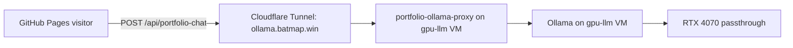

# Portfolio LLM Chatbot Deployment

This repo is hosted as a static GitHub Pages site. GitHub Pages does not run server-side functions, so the browser calls a dedicated public portfolio endpoint on the homelab proxy:

```text
https://ollama.batmap.win/api/portfolio-chat
```

## Runtime architecture



The browser does **not** receive the Ollama bearer token. The public endpoint owns the portfolio system prompt, trims history, limits message size/output, adds CORS headers for GitHub Pages, and applies basic per-IP rate limiting.

## Homelab VM notes

The GPU-backed VM created for this is:

- Proxmox VM: `112`
- Name: `gpu-llm`
- Current LAN IP observed during setup: `192.168.1.223`
- Public tunnel route: `ollama.batmap.win` → `http://192.168.1.223:8080`
- Proxy service: `portfolio-ollama-proxy.service`
- Proxy code: `/opt/portfolio-ollama-proxy/server.py`
- Auth token env file for private `/api/chat`: `/etc/portfolio-ollama-proxy.env`
- Public endpoint for this static site: `/api/portfolio-chat`
- Model: `qwen2.5:3b`
- GPU passthrough fix: use `hostpci0: 0000:0a:00,pcie=1,rombar=0`
- Do **not** use `x-vga=1` for this compute-only Ollama VM.
- Do **not** attach the dynamic GPU hook used earlier for OpenClaw.

## Validation

```bash
curl https://ollama.batmap.win/health
curl -H 'Content-Type: application/json' \
  https://ollama.batmap.win/api/portfolio-chat \
  -d '{"message":"Reply exactly PORTFOLIO_OK"}'
```
