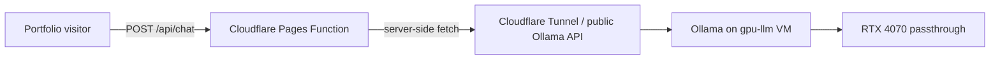

# Portfolio LLM Chatbot Deployment

This repo is a static portfolio with a Cloudflare Pages Function at `functions/api/chat.js`.

## Runtime architecture



The browser no longer calls Ollama directly. The Pages Function owns the system prompt, trims history, caps output, and forwards only safe chat payloads to Ollama.

## Cloudflare Pages environment variables

Set these in the Cloudflare Pages project settings:

- `OLLAMA_CHAT_URL`: URL for the Ollama chat endpoint, for example `https://ollama.batmap.win/api/chat`.
- `OLLAMA_MODEL`: model name, currently recommended `qwen2.5:3b` for fast portfolio Q&A.
- `OLLAMA_PROXY_TOKEN` optional: bearer token if the tunnel/proxy is protected.

## Cloudflare Tunnel route

The batserver tunnel is Cloudflare-managed, so the dashboard remote config is authoritative even if
`/etc/cloudflared/config.yml` is edited locally.

Current route configured during setup:

- `ollama.batmap.win` → `http://192.168.1.223:8080`

In Cloudflare Zero Trust:

1. Go to **Networks → Tunnels**.
2. Open the `batserver` tunnel, ID `fdba2649-af04-40c2-9ead-054e735d08b3`.
3. Open **Public Hostnames**.
4. Edit `ollama.batmap.win`.
5. Set the service URL to `http://192.168.1.223:8080`.
6. Save, then test `https://ollama.batmap.win/health`.

The authenticated proxy token is stored on the VM in `/etc/portfolio-ollama-proxy.env`. Do not commit it.

## Local development

```bash
npm install
npm run dev
```

Then open the URL Wrangler prints and use the floating chat button.

## Homelab VM notes

The GPU-backed VM created for this is:

- Proxmox VM: `112`
- Name: `gpu-llm`
- Current LAN IP observed during setup: `192.168.1.223`
- GPU passthrough fix: use `hostpci0: 0000:0a:00,pcie=1,rombar=0`
- Do **not** use `x-vga=1` for this compute-only Ollama VM.
- Do **not** attach the dynamic GPU hook used earlier for OpenClaw.

Ollama should listen on `0.0.0.0:11434` inside the VM. Expose it through Cloudflare Tunnel or another authenticated reverse proxy before pointing `OLLAMA_CHAT_URL` at it.
